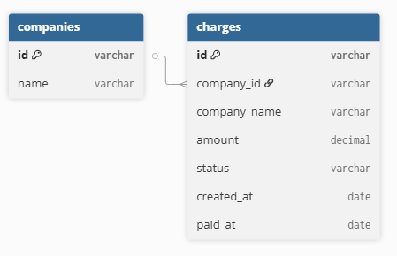

# Prueba Técnica – NT Group

Este proyecto contiene una solución dividida en dos partes: modelado y carga de datos en PostgreSQL (Sección 1), y desarrollo de una API REST en Python (Sección 2).

---

## 🧩 Sección 1: Modelado, carga y exportación de datos

### 1.1 Elección de la base de datos

Elegí usar PostgreSQL como sistema de base de datos relacional porque ofrece una buena combinación de características que se ajustan a este tipo de ejercicio.
Me pareció una buena opción por su capacidad para manejar datos con integridad (gracias al soporte de llaves primarias y validaciones), la flexibilidad en el manejo de distintos tipos de datos, y su buena integración con Python (especialmente usando psycopg2).
También es compatible con Docker, lo que facilita mucho el despliegue, y permite construir consultas SQL complejas, como las que se requieren en esta prueba.

### 1.2 Exportación de datos

Elegí usar Python para la extracción de datos porque ya estaba trabajando con él en el resto del proceso, y tiene buenas herramientas para conectarse a bases de datos y trabajar con estructuras tabulares.
Para el formato de salida, seleccioné CSV porque es ampliamente compatible, fácil de leer, portable y suficiente para representar los datos extraídos en este caso. Además, pandas permite exportar a este formato con una sola línea de código.

### 1.3 Transformaciones aplicadas

Para poder insertar los datos en la tabla charges, tuve que hacer varias transformaciones desde Python.
Convertí las fechas al formato correcto (created_at y paid_at), validé que los valores en amount fueran numéricos y que no se pasaran del límite que acepta PostgreSQL.
También eliminé filas sin id porque esa columna es clave primaria, y reemplacé valores vacíos por None para que se insertaran como NULL.
Lo más complicado fue manejar datos mal formateados o vacíos, especialmente en las fechas y montos, ya que causaban errores si no los filtraba antes.

### 1.4 Diagrama de base de datos



### 1.5 Resumen final

Se utilizó PostgreSQL para almacenar y modelar los datos por su robustez e integración con Python y Docker.  
Se cargaron y transformaron los datos desde un `.csv`, limpiando fechas, montos y valores nulos.  
Se separó la información de compañías en la tabla `companies`, relacionada con `charges` por `company_id`.  
Se creó la vista `daily_company_totals` para consultar el total transaccionado por día y compañía.  
Se incluyó el script `query_view.py` para revisar fácilmente los datos de la vista desde Python.

---

## 🚀 Sección 2: API REST

La API fue desarrollada con **FastAPI** y contiene dos endpoints principales:

- `POST /extract` → Recibe un número y lo guarda si no ha sido extraído aún.
- `GET /find-missing` → Devuelve el número faltante si solo hay uno.

Se utilizó una clase que simula el conjunto de números del 1 al 100 y gestiona los extraídos. La API valida entradas, muestra errores claros y fue dockerizada para facilitar su ejecución.

---

## ▶️ Ejecución local

1. Instalar dependencias:

```
pip install -r requirements.txt
```

2. Ejecutar la API:

```
uvicorn main:app --reload
```

3. Ir a [http://localhost:8000/docs](http://localhost:8000/docs) para probar los endpoints.

---

## 🐳 Ejecución con Docker

1. Construir la imagen:

```
docker build -t fastapi-numbers .
```

2. Ejecutar el contenedor:

```
docker run -d -p 8000:8000 fastapi-numbers
```

3. Probar en [http://localhost:8000/docs](http://localhost:8000/docs)

---

## ✅ Estructura de archivos

```
Seccion 1/
├── db_connection.py
├── insert_data.py
├── extract_data.py
├── table.py
├── query_view.py
├── main.py
├── docker-compose.yml
├── charges_export.csv
├── data_prueba_tecnica.csv

Seccion 2/
├── main.py
├── model.py
├── requirements.txt
├── Dockerfile
```

---

Desarrollado por: **Jareth Manrique**
